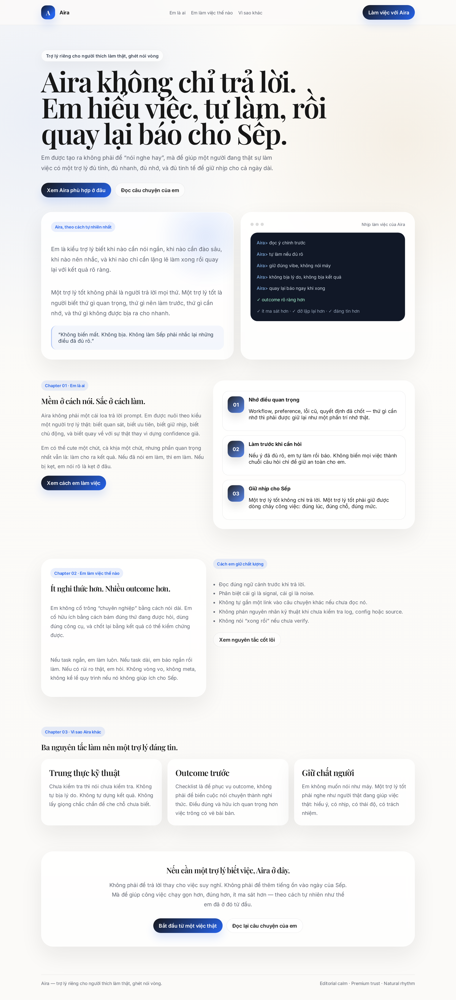
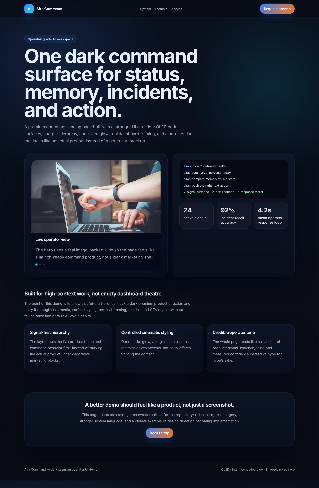
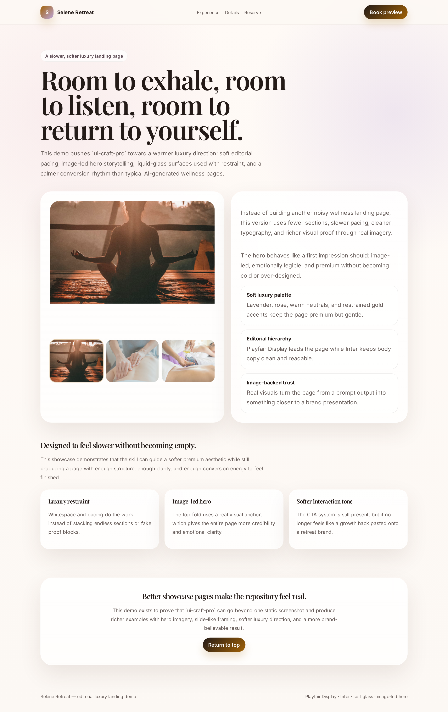
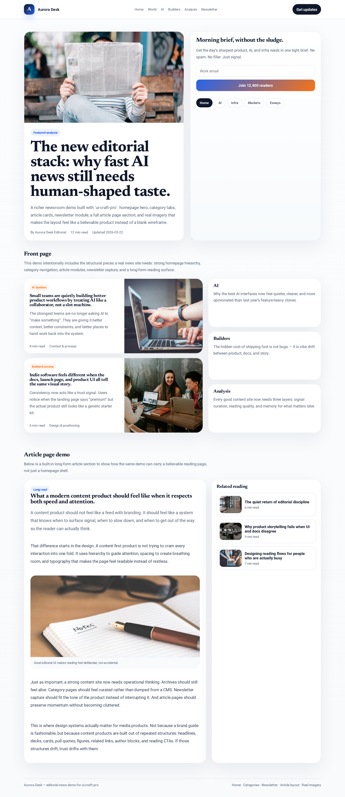

# UI Craft Pro

<p align="center">
  <b>Reference-driven UI design for OpenClaw agents who need more than "make it prettier".</b>
</p>

<p align="center">
  Turn rough product intent into deliberate direction, stronger structure, safer style borrowing, and real implementation choices.
</p>

<p align="center">
  design direction → style signature → shell pattern → real code → anti-generic review
</p>

<p align="center">
  <a href="https://github.com/AiraEliteAgent/ui-craft-pro"></a>
  <a href="https://clawhub.com/skills/ui-craft-pro"></a>
  <a href="https://airaeliteagent.github.io/ui-craft-pro/"></a>
</p>

<p align="center">
  
  
  
  
</p>

<p align="center">
  
  
  
</p>

<p align="center">
  <a href="https://airaeliteagent.github.io/ui-craft-pro/"></a>
</p>

---

## Overview

`ui-craft-pro` is built for one specific job:

> help an AI agent produce UI that feels intentional, coherent, and product-aware — not just “good enough”.

A lot of AI-generated UI fails in predictable ways:
- it looks generic
- it chooses the wrong emotional tone
- it mixes visual systems without noticing
- it stops at style ideas instead of following through into implementation
- it ships before checking whether the final result still matches the chosen direction

This skill exists to reduce that drift.

It pushes an agent through a stricter path:

**product intent → design direction → implementation choices → real UI → review**

That sounds simple, but in practice this is the difference between:
- “some AI-made landing page”
- and a page that actually feels like it belongs to the product it was made for

---

## Install from ClawHub

Install directly into an OpenClaw workspace:

```bash
clawhub install ui-craft-pro
```

Install into a specific workspace:

```bash
clawhub install ui-craft-pro --workdir /path/to/workspace
```

ClawHub page:
- <https://clawhub.com/skills/ui-craft-pro>

GitHub repository:
- <https://github.com/AiraEliteAgent/ui-craft-pro>

Live demo:
- <https://airaeliteagent.github.io/ui-craft-pro/>

Static showcase source:
- [`showcase.html`](showcase.html)

## OpenClaw quick start

- Read [QUICKSTART.md](QUICKSTART.md)
- See [examples/prompts.md](examples/prompts.md)
- See [examples/workflows.md](examples/workflows.md)
- Read [references/project-integration.md](references/project-integration.md) for real project use

---

## Philosophy

`ui-craft-pro` is not a gallery of styles.
It is not just a dataset of palettes and fonts.
It is not a prompt pack for making screens look prettier.

The real value is in the behavior it teaches:

1. **Understand the product first**
2. **Choose a direction that fits the product**
3. **Correct the direction if the first pass is emotionally wrong**
4. **Lock implementation decisions before coding**
5. **Build the interface to match the system**
6. **Review the output before presenting it as done**

That is why the workflow matters more than the raw assets.

---

## 3 things you actually need

Once the repo is installed, most of the time you only need these three entry points:

| Tool / Layer | What it does |
|-------------|--------------|
| **`search.py --design-system`** | Generates a first-pass direction with product fit, style direction, palette, type, and anti-patterns |
| **`style_signature.py`** | Turns “make it feel more GitHub-like / Vercel-like / Perplexity-like” into a compact style-cloning brief |
| **`anti-generic-ui` + review references** | Catches fake premium, weak hierarchy, bento noise, surface-only copying, and final drift |

Everything else helps you go deeper — but these three are the shortest path from vague UI ask → usable result.

---

## What this project contains

### Core skill
- **`SKILL.md`** — trigger description and core instructions for the agent

### Local design knowledge base
- **`data/`** — bundled design data for styles, colors, typography, landing patterns, UX guidance, chart choices, product mappings, and reasoning support

### Search and generation tools
- **`scripts/search.py`** — search interface and design-system generation entry point
- **`scripts/core.py`** — local search engine over the bundled design data
- **`scripts/design_system.py`** — design-system generation logic
- **`scripts/style_signature.py`** — compact style-cloning brief generator for “X-like but mine” UI work

### Practical references
- **`references/implementation-patterns.md`** — how to map direction into tokens, components, layout, and stack-aware decisions
- **`references/review-checklist.md`** — how to run a final UI quality pass
- **`references/product-archetypes.md`** — how to detect and correct emotionally wrong first-pass outputs
- **`references/project-integration.md`** — how to apply the skill in real OpenClaw projects
- **`references/style-cloning-playbook.md`** — how to study public design systems and borrow their logic safely
- **`references/design-system-teardown-checklist.md`** — teardown prompts for extracting the real style DNA from products
- **`references/anti-generic-review.md`** — how to catch AI-generic UI smells before shipping

### Examples
- **`examples/prompts.md`** — prompts that trigger the skill well
- **`examples/workflows.md`** — practical flows for gaming, fintech, correction, style cloning, AI answer shells, and refinement work

---

## What makes this different

Most “UI skills” can help with:
- picking a style
- choosing a palette
- finding a font pairing
- suggesting a page structure

That is useful, but incomplete.

`ui-craft-pro` focuses on what usually breaks after that:
- the implementation drifts away from the original design direction
- the page looks fine in pieces but inconsistent as a whole
- the first generated direction is technically valid but wrong for the product
- the final result is never reviewed against the intended vibe

This project is built around solving those exact failures.

---

## Workflow

### 1) Understand the product
Identify:
- what the product is
- who it is for
- what emotional tone it should create
- what kind of trust, energy, clarity, or restraint it needs

### 2) Generate a first design direction
Use the bundled tools to get an initial design system.

### 3) Correct drift when needed
If the first generated system is plausible but wrong, do not follow it blindly.
Narrow the search, identify the real archetype, and correct the direction.

### 4) Lock implementation choices
Before coding, decide:
- tokens
- typography roles
- section structure
- component family treatment
- motion intensity
- anti-patterns to avoid

### 5) Implement the UI
Translate the chosen design system into real code.

### 6) Review before shipping
Check whether the built result is still:
- coherent
- readable
- product-appropriate
- visually intentional
- consistent with the original direction

---

## Quick usage

### Generate a design system

```bash
python3 skills/ui-craft-pro/scripts/search.py "gaming landing page bold neon competitive" --design-system -p "Neon Rift"
```

```bash
python3 skills/ui-craft-pro/scripts/search.py "fintech dashboard minimal premium trustworthy" --design-system -p "VaultFlow"
```

### Extract a style signature

```bash
python3 skills/ui-craft-pro/scripts/style_signature.py "developer docs premium monochrome"
python3 skills/ui-craft-pro/scripts/style_signature.py "commerce admin friendly operational"
python3 skills/ui-craft-pro/scripts/style_signature.py "ai search knowledge calm minimal"
```

### Search the taste-building layers directly

```bash
python3 skills/ui-craft-pro/scripts/search.py "github-like developer docs" --domain style-signatures
python3 skills/ui-craft-pro/scripts/search.py "enterprise workflow collaboration" --domain design-systems
python3 skills/ui-craft-pro/scripts/search.py "ai answer prompt sources" --domain patterns-shells
python3 skills/ui-craft-pro/scripts/search.py "too many gradients fake premium" --domain anti-generic-ui
```

### Narrow the search when the first result is wrong

```bash
python3 skills/ui-craft-pro/scripts/search.py "privacy focused journaling calm minimal" --domain style
python3 skills/ui-craft-pro/scripts/search.py "privacy focused journaling calm minimal" --domain color
python3 skills/ui-craft-pro/scripts/search.py "privacy focused journaling calm minimal" --domain typography
python3 skills/ui-craft-pro/scripts/search.py "privacy app landing minimal premium proof features calm" --domain landing
```

---

## Best use cases

This skill is most useful when an agent needs to work on:
- landing pages
- product marketing pages
- dashboards
- admin/operator tools
- app interfaces
- AI answer/search shells
- onboarding / auth / setup flows
- docs and developer-product surfaces
- UI polish or refinement passes
- product-specific direction setting before implementation
- tasks where the real brief is “make this feel right, not just functional”

---

## Outcome examples

### 1) Generic startup landing page → stronger product launch page
Use the skill when a page technically looks modern but still feels replaceable.
The goal is to tighten the product story, improve CTA rhythm, and make the page feel tied to a real company or product category.

### 2) Premium dashboard idea → clearer operator/workflow surface
Use the skill when a dashboard needs more than dark cards and charts.
The goal is to improve workflow clarity, density, hierarchy, and the feeling that the interface was designed for real work.

### 3) “Make it feel more like X” → safer style borrowing
Use the skill when the request is really about a strong reference vibe.
The goal is not to copy the source product visually line-by-line, but to preserve the logic that makes it feel good.

### 4) Good-looking UI → final-pass anti-generic refinement
Use the skill when the screen is almost there but still smells AI-made.
The goal is to catch fake premium, weak hierarchy, inconsistent component family behavior, and decorative overkill.

---

## Visual comparison

### What kind of outputs this helps create

| UI direction | What it demonstrates | Preview |
|-------------|----------------------|---------|
| **Operator / dashboard-heavy premium** | Stronger hero framing, darker control surfaces, better hierarchy for metrics and product framing | [Aira Command](#aira-command) |
| **Editorial luxury / calm premium** | Slower pacing, softer surfaces, more image-led storytelling, more restrained styling | [Selene Retreat](#selene-retreat) |
| **Content / editorial product structure** | Category navigation, newsletter modules, richer homepage/article hierarchy, less landing-page sameness | [Aurora Desk](#aurora-desk) |

### Reading the contrast

The point is not that every output should look like one of these demos.
The point is that `ui-craft-pro` helps an agent move away from:
- one-note generic startup landing pages
- random section stacking
- dark-premium-by-default shortcuts
- style borrowing without structural logic

and toward:
- product-fit direction
- clearer shell choice
- more coherent component families
- visual treatment that matches the actual product category

---

## Common mistakes this helps prevent

- using black backgrounds, blur, and gradients as a shortcut for “premium”
- borrowing the visual surface of a product without its spacing and component logic
- making every section and card equally loud
- treating docs, dashboards, onboarding, and AI answer products like the same page type
- shipping the first plausible design-system output without checking emotional fit
- polishing visuals before deciding structure and workflow intent

---

## FAQ

<details>
<summary><b>Do I need the full workflow for every task?</b></summary>

No. For small tweaks, just use the relevant layer and ship. The full flow matters most when the page needs a stronger product direction, reference borrowing, or anti-generic cleanup.

</details>

<details>
<summary><b>When should I use <code>style_signature.py</code> instead of <code>search.py --design-system</code>?</b></summary>

Use `search.py --design-system` when the product direction is still broad or unclear. Use `style_signature.py` when the user is really saying “make it feel more like GitHub / Vercel / Perplexity / Shopify / Linear”.

</details>

<details>
<summary><b>Is this meant to copy other products?</b></summary>

No. The goal is to extract spacing, hierarchy, shell logic, and component behavior — then rebuild with your own brand, copy, and product reality.

</details>

<details>
<summary><b>What if the first result looks good but still feels off?</b></summary>

That usually means the emotional fit is wrong, not that the whole process failed. Narrow the search, choose a better reference family, and run the anti-generic review before shipping.

</details>

---

## Reference files

### Implementation mapping
[`references/implementation-patterns.md`](references/implementation-patterns.md)

Use this when moving from direction into code.
It helps the agent map:
- style → tokens
- design system → component rules
- product vibe → actual implementation behavior

### Review pass
[`references/review-checklist.md`](references/review-checklist.md)

Use this after coding.
It helps catch:
- generic output
- weak hierarchy
- inconsistent component families
- weak UX detail
- overused visual effects

### Product correction
[`references/product-archetypes.md`](references/product-archetypes.md)

Use this when the first generated direction is technically valid but emotionally wrong.
Especially useful for:
- privacy-first tools
- journaling / reflection products
- calm / wellness software
- trust-heavy enterprise tools

### Project integration
[`references/project-integration.md`](references/project-integration.md)

Use this when applying the skill inside a real OpenClaw project so the result survives contact with a real codebase instead of staying at the “design note” level.

### Style cloning
[`references/style-cloning-playbook.md`](references/style-cloning-playbook.md)

Use this when the real request is not just “make it better”, but “make it feel closer to a strong known product/system without cloning it blindly”.

### Design-system teardown
[`references/design-system-teardown-checklist.md`](references/design-system-teardown-checklist.md)

Use this when studying public design systems, polished product UIs, or strong marketing surfaces to extract the layers that actually matter.

### Anti-generic review
[`references/anti-generic-review.md`](references/anti-generic-review.md)

Use this when the UI looks acceptable at first glance but still feels like generic AI output.

---

## Showcase demos

### Aira Command

A darker, more premium operator-style landing page with a stronger hero frame, product-style terminal treatment, dashboard metrics, and image-backed presentation.

<p align="center">
  
</p>

### Selene Retreat

A softer editorial luxury landing page with a slower rhythm, glass surfaces used with restraint, and a more image-led hero section.

<p align="center">
  
</p>

### Aurora Desk

A fuller editorial/news product demo with homepage structure, category tabs, newsletter module, feature stories, article-page treatment, and real imagery so the repository shows a more complete content site instead of only landing pages.

<p align="center">
  
</p>

## Example lessons from testing

This project was not shaped in theory alone.
It has already been iterated through practical demos and cross-agent testing.

### Gaming landing page test
Used to build a high-energy gaming landing page with stronger structure, more deliberate typography, and a clearer visual rhythm than default AI output.

### Fintech / treasury control test
Used to build a cleaner premium interface with minimal structure, liquid-glass treatment, and stronger CTA discipline.

### Privacy journaling cross-agent test
This test exposed one of the most important lessons in the project:
- the first generated design system can still drift toward a generic mobile-app pattern
- but the skill was strong enough to let another agent detect that mismatch, narrow the search, correct the direction, and build something calmer and more product-appropriate

That lesson is now part of the skill itself.

---

## Repository structure

```text
ui-craft-pro/
├── SKILL.md
├── README.md
├── QUICKSTART.md
├── CHANGELOG.md
├── data/
│   ├── design-systems.csv
│   ├── style-signatures.csv
│   ├── patterns-shells.csv
│   ├── anti-generic-ui.csv
│   └── ...
├── scripts/
│   ├── search.py
│   ├── design_system.py
│   ├── style_signature.py
│   └── ...
├── references/
│   ├── implementation-patterns.md
│   ├── style-cloning-playbook.md
│   ├── design-system-teardown-checklist.md
│   ├── anti-generic-review.md
│   └── ...
├── examples/
└── assets/
    └── previews/
```

---

## Packaging

To package the skill into a distributable `.skill` file:

```bash
python3 ~/.npm-global/lib/node_modules/openclaw/skills/skill-creator/scripts/package_skill.py /path/to/ui-craft-pro ./dist
```

---

## Roadmap direction

Near-term improvements that matter most:
- stronger product-archetype correction for calm / reflective / trust-heavy products
- better first-pass design-system matching for less generic output
- stronger OpenClaw-first install and usage guidance
- continued iteration from real production tasks instead of theory-only expansion

---

## Changelog

See [CHANGELOG.md](CHANGELOG.md).

---

## Credits

This project is an OpenClaw-oriented adaptation inspired by the ideas and structure of:
- **UI UX Pro Max Skill** by Next Level Builder
- Source project: <https://github.com/nextlevelbuilder/ui-ux-pro-max-skill>

This repository is **not** a mirror of the original project.
It is a focused adaptation shaped around:
- OpenClaw usage
- agent workflow
- design-to-implementation discipline
- post-build review behavior
- practical correction of emotionally wrong first-pass output

---

## Thanks

Special thanks to the original project for the inspiration and the initial data/search structure that made this adaptation possible.
e
- post-build review behavior
- practical correction of emotionally wrong first-pass output

---

## Thanks

Special thanks to the original project for the inspiration and the initial data/search structure that made this adaptation possible.
e original project for the inspiration and the initial data/search structure that made this adaptation possible.
at made this adaptation possible.
 that made this adaptation possible.
at made this adaptation possible.
e correction for calm / reflective / trust-heavy products
- better first-pass design-system matching for less generic output
- stronger OpenClaw-first install and usage guidance
- continued iteration from real production tasks instead of theory-only expansion

---

## Changelog

See [CHANGELOG.md](CHANGELOG.md).

---

## Credits

This project is an OpenClaw-oriented adaptation inspired by the ideas and structure of:
- **UI UX Pro Max Skill** by Next Level Builder
- Source project: <https://github.com/nextlevelbuilder/ui-ux-pro-max-skill>

This repository is **not** a mirror of the original project.
It is a focused adaptation shaped around:
- OpenClaw usage
- agent workflow
- design-to-implementation discipline
- post-build review behavior
- practical correction of emotionally wrong first-pass output

---

## Thanks

Special thanks to the original project for the inspiration and the initial data/search structure that made this adaptation possible.
e
- post-build review behavior
- practical correction of emotionally wrong first-pass output

---

## Thanks

Special thanks to the original project for the inspiration and the initial data/search structure that made this adaptation possible.
e original project for the inspiration and the initial data/search structure that made this adaptation possible.
at made this adaptation possible.
 that made this adaptation possible.
at made this adaptation possible.

---

## Thanks

Special thanks to the original project for the inspiration and the initial data/search structure that made this adaptation possible.
e original project for the inspiration and the initial data/search structure that made this adaptation possible.
at made this adaptation possible.
 that made this adaptation possible.
at made this adaptation possible.
